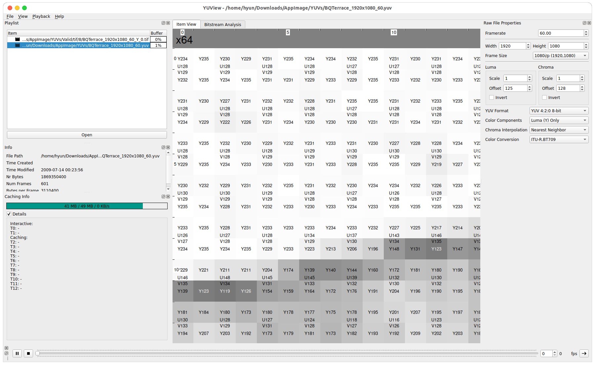
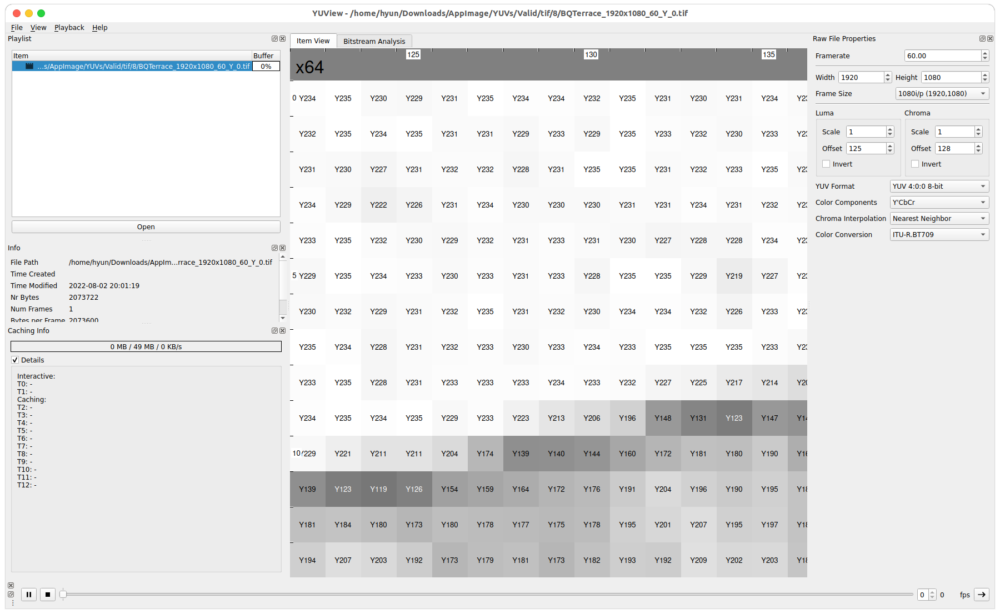

# YUV2PNG - Python Implementation
YUV2PNG is one of the preprocessing processes of the [ Video super resolution](https://github.com/Hyunmin-jasper-Cho/VideoSuperResolution) project,  
and it makes each .yuv sequence into .png/.tiff format, which consists of y000.png, u000.png and v000.png.  

- PNG -> Make an image as grayscale **RGB** format.  
- TIFF > Make an image as **YUV** format.  

**PNG-additional information**  
When you store as .png file, it is saved as **RGB** colour space, but it store only each Y/U/V components.  
e.g) When saving the **Y component** as .png format, if the pixel's y value = 214, then .png save as R = 214, G = 214 and B = 214.  

Therefore, it **does not matter** to train a model using a YUV components. (Just **divide** channel and use one of them)

## Execution Result (TIFF format, viewer: [YUView](https://github.com/ient/yuview))
**Original YUV**  
  

**TIFF Y component image**  

## Environment 
> python3

## How to execute
> 1. After downloading the cloned zip file, save it in the local folder.
> 2. After moving into cloned directory, put the .yuv file in YUV420_X/`your_yuv_name.yuv`.  
> 3. Exeucute  

When execute, you can simply run demo.sh file.  
Or, run as below command  
$ `python3` `yuv2png.py` `YUV_root_path` `IMG_root_path` `Bit depth` `Width` `Height` `Format(png/tiff)`  

For example, for 10bit YUV, if you want to extract image as .tiff file, follow below command  
$ `python3 yuv2png.py ./YUV420_10 ./TIFF_10 10 3840 2176 tiff`  

More information about execution is in **demo.sh** file.   

## Result
- When executed, the corresponding .png/.tiff file is automatically created in `IMG_root`/`your_yuv_name`/ directory.  

**Warning**
> When you execute the .sh file, you should match your yuv's **width and height**.  
