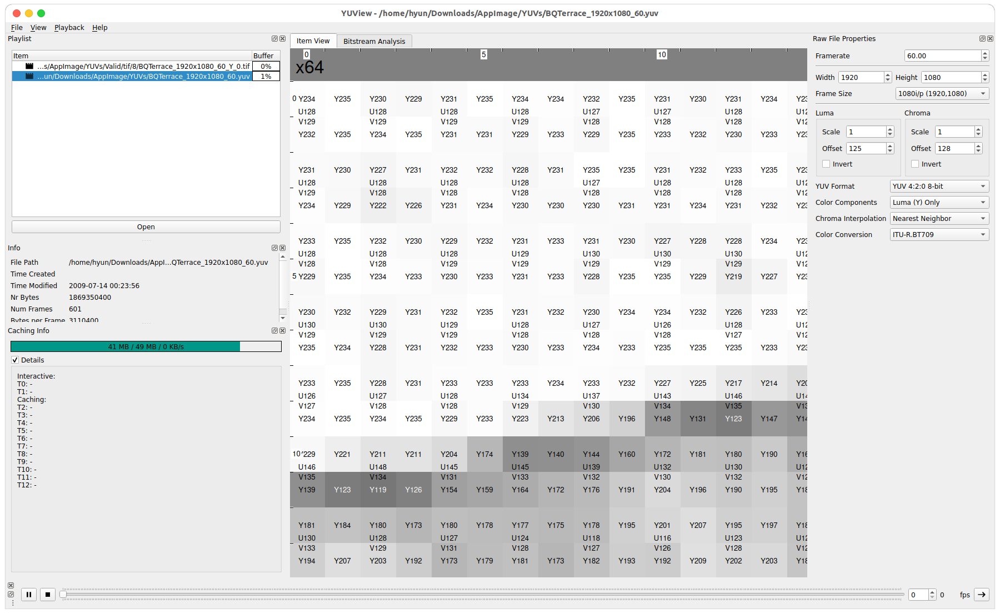
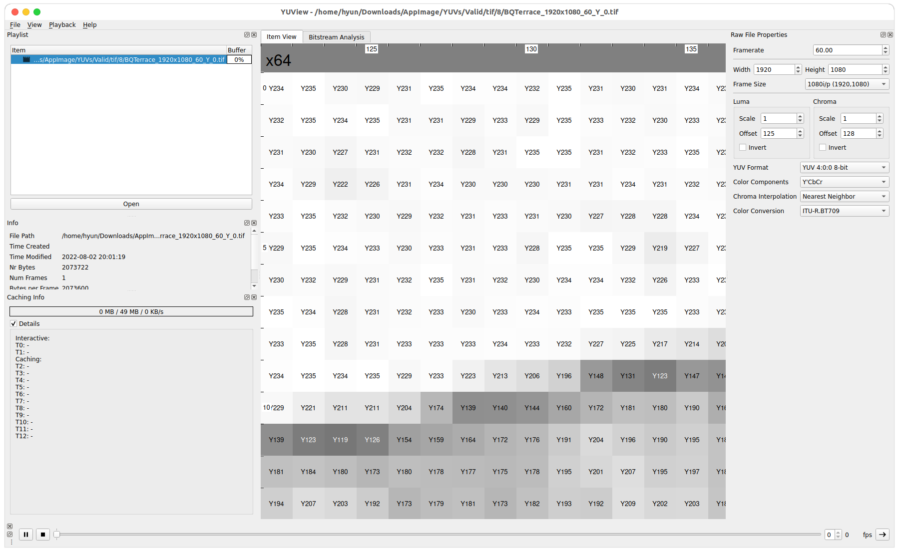

# YUVExtractor - Python Implementation
YUVExtractor is one of the preprocessing processes of the [ Video super resolution](https://github.com/Hyunmin-jasper-Cho/VideoSuperResolution) project,  
and it makes each .yuv sequence into .png/.tiff format, which consists of y000.png, u000.png and v000.png.  

- PNG -> Make an image as grayscale **RGB** format.  
- TIFF > Make an image as **YUV** format.  

**PNG-additional information**  
When you store as .png file, it is saved as **RGB** colour space, but it store only each Y/U/V components.  
e.g) When saving the **Y component** as .png format, if the pixel's y value = 214, then .png save as R = 214, G = 214 and B = 214.  

Therefore, it **does not matter** to train a model using a YUV components. (Just **divide** channel and use one of them)

## Execution Result (TIFF format, viewer: [YUView](https://github.com/ient/yuview))
**Original YUV**  
  

**TIFF Y component image**  

## Extractor-Channel & Frame
> Channel: Create ~_Y_x.png, ~_U_x.png and ~_V_x.png ...
> Frame: Create ~_x.png, ~_x+1.png ... 

## Environment 
> python3

## How to execute
> 1. After downloading the cloned zip file, save it in the local folder.
> 2. After moving into cloned directory, put the .yuv file in yuv_x/`your_yuv_name.yuv`.  
> 3. Specify Shell file (demo.sh) and run it.   

## Parameters settings
**YUV2PNG-python3 runner**

you shoud send 6 parameters    
1. YUV root path (./YUVs)     
2. IMG root path (./PNGs)       
3. Bit depth              
4. width                
5. height               
6. format (lower case)        
7. ref (optional)           

## Result
- When executed, the corresponding .png/.tiff file is automatically created in `IMG_root`/ folder.
